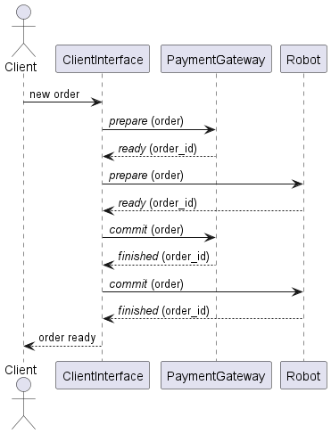
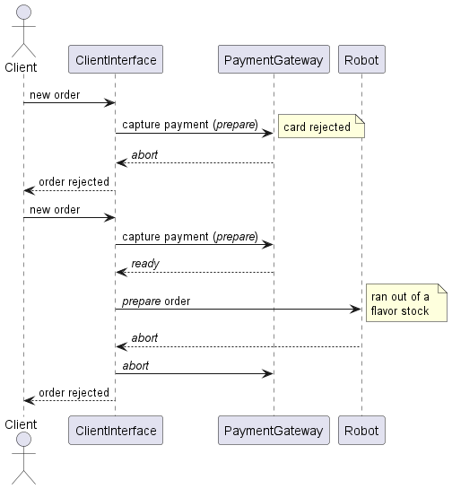
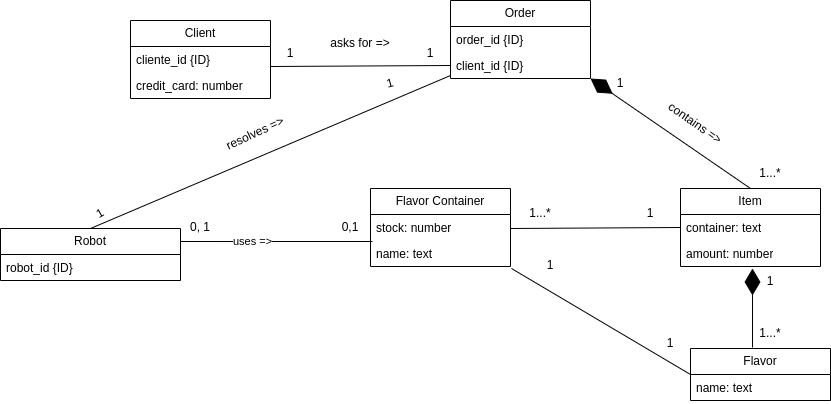

<div align="center">
  
&nbsp; &nbsp; &nbsp; &nbsp;
  

  # GridRust
</div>

[](https://classroom.github.com/a/PKo6zpFB)

<!-- TODO: insertar link -->
[Link al video presentación]()

## Índice
- [GridRust](#gridrust)
  - [Índice](#índice)
  - [Ejecución](#ejecución)
  - [Diseño](#diseño)
    - [Interfaces de Clientes](#interfaces-de-clientes)
      - [Resiliencia en las pantallas](#resiliencia-en-las-pantallas)
    - [Gestión de Pedidos](#gestión-de-pedidos)
      - [Resiliencia en los robots](#resiliencia-en-los-robots)
    - [Gateway de Pagos](#gateway-de-pagos)
  - [Comunicación entre procesos](#comunicación-entre-procesos)
    - [Protocolos de comunicación](#protocolos-de-comunicación)
      - [Mensajes de Interfaces de Clientes a Gateway de Pagos y a Gestión de Pedidos](#mensajes-de-interfaces-de-clientes-a-gateway-de-pagos-y-a-gestión-de-pedidos)
    - [Mensajes entre Pantallas](#mensajes-entre-pantallas)
      - [Mensajes de Gateway de Pagos y Gestión de Pedidos a Interfaces de Clientes](#mensajes-de-gateway-de-pagos-y-gestión-de-pedidos-a-interfaces-de-clientes)
    - [Cómo ejecutar las aplicaciones](#cómo-ejecutar-las-aplicaciones)
      - [Gestión de Pedidos](#gestión-de-pedidos-1)
      - [Interfaces de Clientes](#interfaces-de-clientes-1)
      - [Mensajes entre Robots y Coordinador](#mensajes-entre-robots-y-coordinador)
  - [Modelo de dominio](#modelo-de-dominio)
  - [Supuestos](#supuestos)
  - [Cambios al diseño inicial](#cambios-al-diseño-inicial)

## Ejecución
Para ejecutar las aplicaciones se deberán ingresar los siguientes comandos en distintas terminales desde el root del repositorio:
- **Interfaces de Clientes**
  - Para ejecutar **todas** las interfaces:
  ```sh 
  cd clients_interfaces
  cargo run --bin clients_interfaces
  ```
  - Para ejecutar una sola interfaz (con $id = {0, 1, 2}$):
  ```sh 
  cd clients_interfaces
  cargo run --bin screen <id>
  ```
- **Gestión de Pedidos**
  - Para ejecutar **todos** los robots:
  ```sh 
  cd robots_simulation
  cargo run --bin robots_simulation
  ```
  - Para ejecutar un solo robot (con $id = {0, 1, 2, 3, 4}$):
  ```sh 
  cd robots_simulation
  cargo run --bin robot <id> <coordinator_id>
  ```
  Si se ejecutan varios por separado, asignarles a todos el mismo _coordinator_id_.

- **Gateway de Pagos**
  ```sh 
  cd payment_gateway
  cargo run
  ```

## Diseño
Se tienen tres aplicaciones distintas que se comunican a través de sockets UDP:
- **Interfaces de Clientes**: Modela las pantallas con las que los clientes hacen sus pedidos.
- **Gestión de Pedidos**: Simula los robots que preparan los helados. 
- **Gateway de Pagos**: Es donde se captura y luego efectiviza el pago. 


### Interfaces de Clientes
Se modela cada interfaz de cliente o pantalla, la cual lee de un archivo pedidos simulados y los convierte en **órdenes de pedidos**. Luego, inicia una transacción por cada uno. En este caso, es un **pedido de helado**. Se generan varias instancias (como distintos procesos) de esta aplicación para simular un número constante de pantallas en la heladería. Para llevar a cabo la transacción se plantea utilizar:
- **Commit de dos fases**: Cada instancia actúa como **coordinador** del pedido que se encuentra procesando. En este caso el compromiso es entregar el helado solicitado. Los pasos del algoritmo son:
  1. El coordinador que ejecuta la orden de pedido escribe en su log _prepare_ indicando que inicia la preparación del pedido y le envía a Gateway de Pagos el mensaje _prepare_, para preguntar si puede capturar el pago.
  2. En el caso de pago capturado satisfactoriamente, envía _prepare_ a Gestión de Pedidos. De lo contrario aborta la transacción.
  3. Si el pedido es preparado correctamente, el coordinador efectúa y finaliza el compromiso enviando un mensaje _commit_ a Gestión de Pedidos y al Gateway de Pagos para efectivizar el cobro. Caso contrario se aborta el pedido y se cancela el pago.

#### Resiliencia en las pantallas
- Para verificar el estado de cada pantalla, entre las mismas se envían mensajes de tipo _ping_ cada cierto tiempo para verificar que siguen procesando pedidos. En el mensaje _pong_ de respuesta se envía la información del último pedido completado. De esta forma, una pantalla puede tomar los pedidos de la caída continuando desde el pedido que corresponde. Se utiliza el modelo de actores para la comunicación entre las pantallas.
- Cuando se detecta que una pantalla está caída, los pedidos que estaba manejando se reasignan a otra pantalla. Ya se tiene establecido qué pantalla se hace cargo de cual en caso de que se caiga alguna. 

  En particular, teniendo las pantallas 0, 1, 2, 3:
  - Si se cae la 0, se hace cargo la 1.
  - Si se cae la 1, se hace cargo la 2.
  - Si se cae la 2, se hace cargo la 3.
  - Si se cae la 3, se hace cargo la 0.

### Gestión de Pedidos
 Esta aplicación se comunica con Interfaces de Clientes, recibiendo órdenes de pedidos y respondiendo si el robot asignado pudo preparar el pedido para su entrega. Se utilizan las siguientes herramientas de concurrencia:
- **Modelo de actores** para los robots:
Tienen como estado interno el contenedor que están empleando, en caso de que estén usando alguno. Los tipos de mensajes son para solicitar un contenedor, liberarlo, y para otorgar o denegar su acceso. 
- **Algoritmo Centralizado** para sincronizar los accesos a los contenedores de helado por parte de los robots con optimización:
  - Se elige a un robot como coordinador.
  - Cada robot le envía al coordinador un vector con los contenedores (sabores) a los que necesita acceder.
  - El coordinador recorre el vector y le da acceso al primer contenedor que esté disponible.
  - Si hay algún contenedor disponible, le envía un enum Response::AccesoConcedido(IceCreamFlavor).
  - Si ningún contenedor está disponible, le manda un enum Response::AccesoDenegado(<razón>) con la razón por la cuál no pudo acceder. Además, agrega la request del robot a una cola.
  - Cuando se libera algún contenedor, el coordinador saca la/s request/s de la cola y se fija si el contenedor que se liberó le sirve a algún robot.
  
  Se decidió utilizar este algoritmo, porque, tal como se indica en el libro _Distributed Operating Systems_ de Tanenbaum, es el más simple de los algoritmos. Citando el libro, "El algoritmo centralizado es el más sencillo y también el más eficiente. Sólo requiere de tres mensajes para entrar y salir de una región critica: una solicitud y otorgamiento para entrar y una liberación para salir". El único problema que puede ocurrir es que falle el coordinador, pero existen algoritmos para detectar esto y elegir otro.
- **Algoritmo Bully** para elegir robot coordinador al inicio y en caso de que falle (cuando un robot observa que el coordinador ya no responde las solicitudes por un timeout definido), inicia una elección:
  1. El robot envía _ELECTION_ a los demás procesos con un id mayor.
  2. Si nadie responde, este gana la elección y se convierte en el coordinador. Se anuncia enviando un mensaje _COORDINATOR_ a todo el resto.
  3. Si alguno de los robots con id mayor le responde _OK_, este repite el mismo proceso y el trabajo del robot que llamó a elecciones termina.

  En el caso en que un robot estaba esperando para entrar en la sección crítica cuando cambia el coordinador, cuando termina la elección del nuevo coordinador, el robot que estaba esperando vuelve a solicitar el acceso al nuevo coordinador.
  
  Por lo visto en la bibliografía, no hay mucha diferencia entre los algoritmos de elección, no hay ventajas significativas entre elegir uno u otro.

#### Resiliencia en los robots

- Para verificar el estado de cada robot, el coordinador enviará un mensaje _ping_ a cada uno de ellos. Si no se recibe respuesta en un tiempo determinado, se considerará que el robot está caído.
- Cuando se detecta que un robot está caído y estaba procesando un pedido, el coordinador reasigna el pedido a otro robot. Para poder hacer esto, el coordinador mantiene un diccionario con lo que está haciendo cada robot. 
- Cuando se cambia el coordinador, cada robot le manda al coordinador el pedido que estaba haciendo, junto con la pantalla que lo pidió. Luego, el coordinador nuevo le envía a cada pantalla de nuevo _ready_ para el pedido que pidió y se está haciendo.

### Gateway de Pagos
Se trata de una aplicación simple que _loguea_ en un archivo. Se tendrá una sola instancia de la misma que se encargará de recibir mensajes _prepare_  del coordinador (que se encuentra en Interfaces de Clientes), preguntando si se puede capturar el pago (la tarjeta puede fallar con una probabilidad aleatoria). Su respuesta será _ready_ o _abort_ dependiendo el caso. Luego, si se logra entregar el pedido correctamente, recibirá un mensaje _commit_ al que responderá con _finished_ y se realizará el cobro efectivo.

## Comunicación entre procesos
Para asegurar una comunicación confiable entre los procesos usando sockets UDP, cada mensaje enviado esperará una respuesta del receptor. En caso de no recibir respuesta en un tiempo determinado, se considerará que se perdió el paquete y se reenviará el mensaje. Se utilizarán protocolos de comunicación simples, donde cada mensaje tendrá un formato específico.

A continuación se presentan diagramas de secuencia que muestran el intercambio de mensajes entre las entidades en distintos escenarios:

- Pedido realizado correctamente
  


- Pedidos cancelados por captura del pago rechazada y por falta de stock de algún sabor
  


### Protocolos de comunicación
#### Mensajes de Interfaces de Clientes a Gateway de Pagos y a Gestión de Pedidos
Las pantallas enviarán tanto al Gateway de Pagos como a Gestión de Pedidos mensajes con el siguiente formato:

			{message_type}\n{payload}
     
El tipo del mensaje es un string que puede ser:
- `prepare`: Se envía al principio para iniciar la transacción por cada pedido.
- `commit`: Si ambas entidades responden `ready` al mensaje anterior, se les envía este mensaje señalando que el pedido fue realizado correctamente. Le indica al Gateway de Pagos que efectivice el cobro.
- `abort`: Si alguna de las entidades al recibir el `prepare` devuelve este mismo tipo de mensaje, se les envía a ambas indicando que la transacción fue abortada.

El payload es el pedido serializado en formato JSON:
```
pub struct Order {  
  order_id: usize,  
  client_id: usize,  
  credit_card: String,  
  items: Vec<Item>  
}
```

### Mensajes entre Pantallas
Las pantallas se comunicarán entre sí para garantizar que todas siguen activas mediante mensajes con el siguiente formato:

              "screen"\n{message_type}

El tipo de mensaje se encuentra representado en un enum llamado *ScreenMessage* que puede ser:
- `ping`: lo envía una pantalla para verificar si la pantalla a su cargo sigue activa.
- `pong`: Es la respuesta de la pantalla "pingueada" junto con el id de la última orden procesada.
- `finished`: Indica que la pantalla finalizó el procesamiento de todos sus pedidos.

#### Mensajes de Gateway de Pagos y Gestión de Pedidos a Interfaces de Clientes
Tanto el Gateway de Pagos como Gestión de Pedidos utilizarán el siguiente formato para el envío de mensajes:

   			{message_type}\n{order_id}
El mensaje podrá ser de tipo:
- `ready`: Como respuesta a `prepare` indica que se pudo realizar correctamente la captura del pago o el pedido dependiendo el caso.
- `abort`: También como respuesta a `prepare` indica que falló la captura del pago o no se pudo preparar el pedido.
- `finished`: Es la respuesta que se le da al mensaje `commit` cuando se llega a la segunda fase de la transacción.
- `keepalive`: Se utiliza para indicar que la pantalla no está caída y está intentando terminar la preparación del pedido (solo lo envía Gestión de Pedidos).

#### Mensajes entre Robots y Coordinador
Para pedir y liberar el acceso a los contenedores de helado e indicarle al coordinador que se completó la orden, se utilizará el siguiente formato de mensaje: 
			
   					{access}\n{payload}

El payload es un tipo del enum `RequestToCoordinator` serializado en formato _JSON_ que puede ser: 
- `SolicitarAcceso`: Incluye el id del robot y el vector de sabores a los que se pide acceso.
- `LiberarAcceso`: Incluye el id del robot y el sabor de helado al que tenía acceso.
- `OrdenTerminada`: Incluye el id del robot y la _Order_ completada serializada.

El **coordinador**, para contestarle a los robots y asignar pedidos, utiliza el siguiente formato de mensaje: 

   				{access}\n{payload}

El payload es un tipo del enum `Response` serializado en formato _JSON_ que puede ser: 
- `AccesoConcedido`: Incluye el sabor de helado al que le dió acceso.
- `AccesoDenegado`: Incluye la razón por la cual no le pudo dar acceso.
- `AssignOrder`: Incluye el id del robot y la _Order_ asignada.

## Modelo de dominio

 

- Cada **pedido** posee los siguientes atributos:
  - **id**: clave numérica única para cada uno.
  - **id del cliente**: clave numérica única del cliente que lo realiza.
  - **tarjeta de crédito**: los 16 números de la misma en formato string.
  - **ítems**: lista de productos que lo conforman.  
- Cada **ítem** tiene los siguientes atributos:
  - **contenedor**: puede ser vasito, cucurucho, 1/4 kg, 1/2 kg o 1 kg. 
  - **cantidad**: número de unidades del mismo.
  - **sabores**: lista de sabores que pueden ser chocolate, frutilla, vainilla, menta y limón. El máximo de sabores para cualquier producto es 3.

## Supuestos
- Se define la cantidad de instancias de interfaces de clientes en 3.
- La cantidad de instancias de robots es 5.
- La aplicación del Gateway de Pagos nunca se cae.
- En el caso de que un robot esté preparando un pedido y no haya más stock del gusto a servir, se desecha todo lo servido previamente y el pedido queda cancelado.
- Los puertos de las pantallas y los robots son conocidos. 
- El pago se captura aleatoriamente con una probabilidad de 0.9.

## Cambios al diseño inicial
- Optimización del algoritmo centralizado para cuando varios robots están ejecutando pedidos que comparten algún gusto pero no todos.
- Protocolos de los mensajes: tipos y payloads.
- Cada pantalla con su propio archivo en lugar de una cola centralizada de pedidos.
- Implementación del modelo de actores en Interfaces de Clientes para la comunicación entre las mismas con el objetivo de que sean resilientes ([Resiliencia en las pantallas](#resiliencia-en-las-pantallas)).