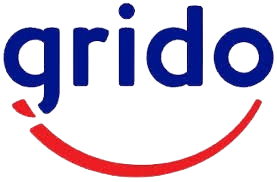
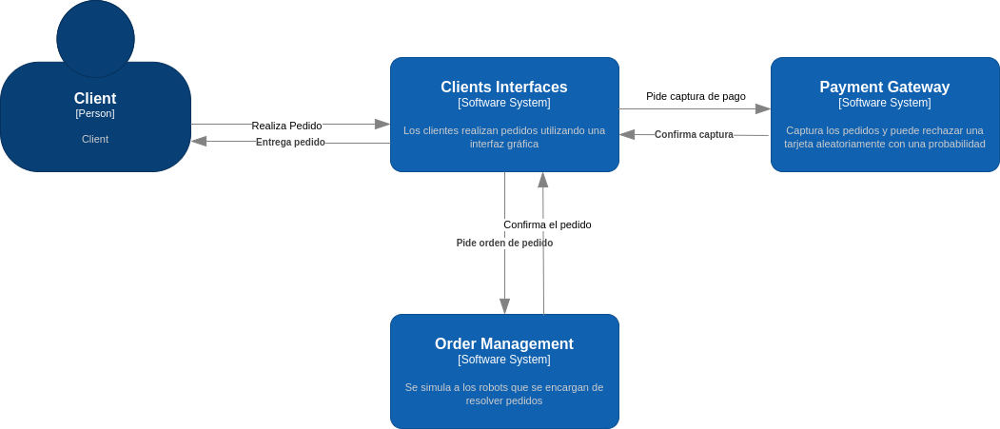
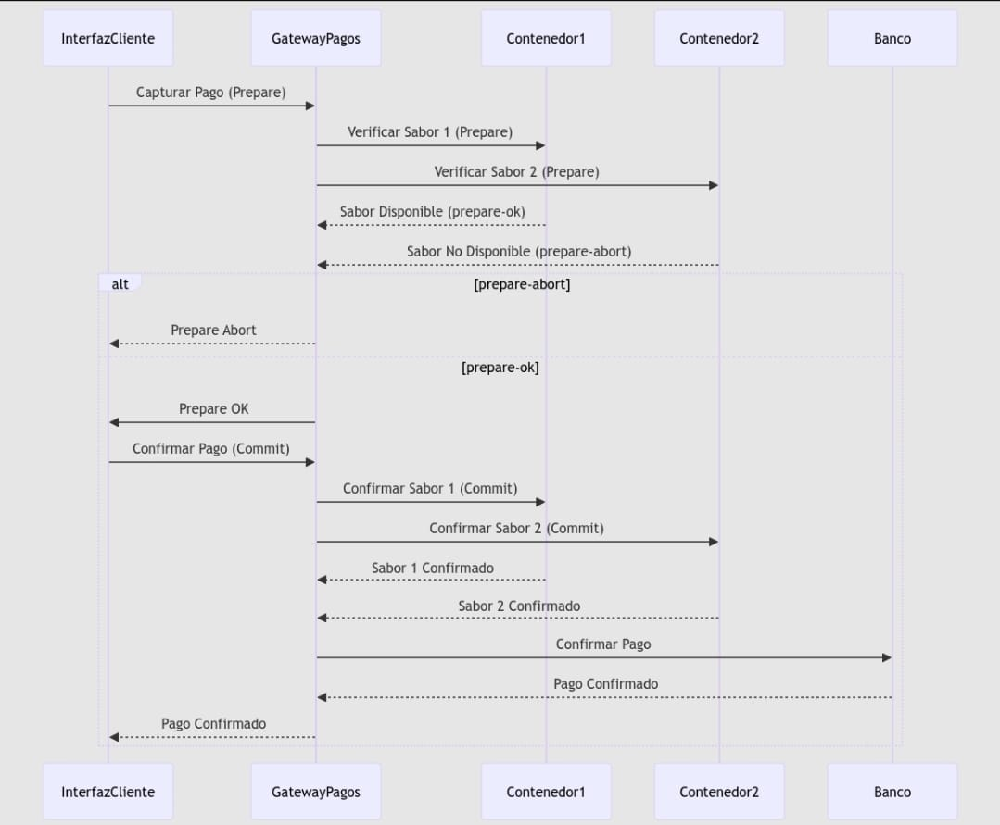

# GridRust

  
&nbsp; &nbsp; &nbsp; &nbsp;
  

## Índice
- [GridRust](#gridrust)
  - [Índice](#índice)
  - [Introducción](#introducción)
  - [Interfaces de Clientes](#interfaces-de-clientes)
  - [Gestión de Pedidos con robots](#gestión-de-pedidos-con-robots)
  - [Gateway de Pago](#gateway-de-pago)
  - [Supuestos](#supuestos)
  - [Conclusión](#conclusión)

##  Introducción
El diseño del modelo consta de tres aplicaciones distintas, las cuáles se comunican a través de sockets.

## Interfaces de Clientes
Se plantea utilizar programación asincrónica para esperar a recibir los helados de gestión de pedidos. Los mismos vendrán de un archivo *jsonl*.

## Gestión de Pedidos con robots
- Modelo de actores para los robots:
    Tendrían como estado interno el contenedor que están usando o si no están usando ninguno. Los tipos de mensajes serían para solicitar un contenedor, para liberarlo, para otorgarlo y para denegarlo.
    También debería tener mensajes para iniciar una elección, para responderle OK, y para avisar que se fue elegido coordinador.
- Algoritmo centralizado para sincronizar los accesos a los contenedores de helado por parte de los robots: 
    Se elige a un robot como coordinador. Si un robot quiere usar alguno de los contenedores de helado le envía un mensaje de solicitud al coordinador, donde indica qué contenedor quiere     usar, si ningún otro robot lo está usando el coordinador le responde OK y lo deja entrar. En cambio si ya hay algún robot utilizando ese contenedor el coordinador le envía ACK y se        bloquea el solicitante, y se agrega su solicitud a una cola. Cuando el robot que estaba usando el contenedor termina le avisa al coordinador y este saca al solicitante de la cola y le     otorga el contenedor enviándole OK.
	
    Justificación: se cita el libro de Distributed Operating Systems de Tanenbaum; “El algoritmo centralizado es el más sencillo y también el más eficiente. Sólo requiere de tres       mensajes para entrar y salir de una región critica: una solicitud y otorgamiento para entrar y una liberación para salir”. El único problema que puede ocurrir es que falle el               coordinador, pero existen algoritmos para detectar esto y elegir otro.

- Algoritmo Bully para elegir robot coordinador al inicio y en caso de que falle:
  Cuando un robot observa que el coordinador ya no responde las solicitudes (por un timeout constante que se define), inicia una elección:
  El robot envía ELECCIÓN a los demás procesos con un número mayor.
  Si nadie responde, este gana la elección y se convierte en el coordinador.
  Si uno de los robots con un número mayor responde, toma el control y el trabajo del robot que llamó a elecciones termina.

  Por lo que dice la bibliografía no hay mucha diferencia entre los algoritmos de elección, no hay ventajas significativas entre elegir uno u otro.

## Gateway de Pago
- Commit de dos fases para la captura (cuando se toma el pedido), se arma el helado y el pago efectivo (entrega del helado):
  En este caso el compromiso es entregar el helado solicitado.
   1. Hay un proceso coordinador que ejecuta la transacción, este escribe en su log prepare indicando que inicia la preparación del pedido y le envía al resto de los procesos prepare,     para avisarle a los demás procesos que estén listos para el compromiso.
  2. Cuando un proceso recibe el mensaje verifica si está listo para el compromiso y lo escribe en el log y envía su decisión
  3. Si el coordinador recibe todas las respuestas de los procesos diciendo que están listos para comprometerse se efectúa y finaliza el compromiso, si alguno no se puede comprometer se     aborta la preparación del helado.
En este caso no sé si los procesos deberían ser los propios robots u otra estructura, podrían ser los contenedores de helado que se consultan para saber si hay suficiente de cada gusto para completar el pedido.

## Supuestos
- 

## Conclusión

