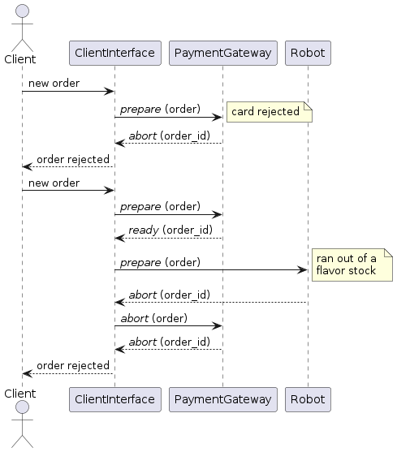

  
&nbsp; &nbsp; &nbsp; &nbsp;
  

  # GridRust

## Índice
- [GridRust](#gridrust)
  - [Índice](#índice)
  - [Diseño](#diseño)
    - [Interfaces de Clientes](#interfaces-de-clientes)
    - [Gestión de Pedidos](#gestión-de-pedidos)
    - [Gateway de Pagos](#gateway-de-pagos)
  - [Diagramas de secuencia](#diagramas-de-secuencia)
  - [Modelo de dominio](#modelo-de-dominio)
  - [Supuestos](#supuestos)
  - [Dudas sobre diseño](#dudas-sobre-diseño)

## Diseño
Se tienen tres aplicaciones distintas que se comunican a través de sockets UDP:
- **Interfaces de Clientes**: Modela las pantallas con las que los clientes hacen sus pedidos.
- **Gestión de Pedidos**: Simula los robots que preparan los helados. 
- **Gateway de Pagos**: Es donde se captura y luego efectiviza el pago. 

### Interfaces de Clientes
Se modela cada interfaz de cliente o pantalla, la cual lee de un archivo pedidos simulados y los convierte en **órdenes de pedidos**. Luego inicia una transacción por cada uno, que en este caso representa un **pedido de helado** (se plantea utilizar programación asincrónica para esperar por la respuesta y mientras tanto dar oportunidad a atender otro pedido). Se generan varias instancias (como distintos procesos) de esta aplicación para simular un número constante de pantallas en la heladería. Para llevar a cabo la transacción se plantea utilizar:
- **Commit de dos fases**: Cada instancia actúa como **coordinador** del pedido que esté procesando. En este caso el compromiso es entregar el helado solicitado. Los pasos del algoritmo son:
  1. El coordinador que ejecuta la orden de pedido escribe en su log _prepare_ indicando que inicia la preparación del pedido y le envía a Gateway de Pagos el mensaje _prepare_, para preguntar si puede capturar el pago.
  2. En el caso de pago capturado satisfactoriamente, envía _prepare_ a Gestión de Pedidos. De lo contrario aborta la transacción.
  3. Si el pedido es preparado correctamente, el coordinador efectúa y finaliza el compromiso enviando un mensaje _commit_ al robot y al Gateway de Pagos para efectivizar el cobro. Caso contrario se aborta el pedido y se cancela el pago.

### Gestión de Pedidos
Esta aplicación se comunica con **Interfaces de Clientes**, recibiendo órdenes de pedidos y respondiendo si fue posible por el robot preparar el pedido para su entrega. Se plantea utilizar las siguientes herramientas de concurrencia:
- **Modelo de actores** para los robots:
Tienen como estado interno el contenedor que están empleando en caso de estén usando alguno. Los tipos de mensajes serán para solicitar un contenedor, liberarlo, y para otorgar o denegar su acceso. 
- **Algoritmo Centralizado** para sincronizar los accesos a los contenedores de helado por parte de los robots: Se elige a un robot como coordinador. Si alguno quiere utilizar alguno de los contenedores de helado le envía un mensaje de solicitud al coordinador, en donde indica qué contenedor quiere usar. Si ningún otro robot lo está usando el coordinador le responde _OK_ y lo deja entrar. En cambio, si ya hay algún robot utilizando ese contenedor el coordinador, le envía _ACK_ y se bloquea el solicitante agregando su solicitud a una cola. Cuando el robot que estaba usando el contenedor termina, le avisa al coordinador y este saca al solicitante de la cola para otorgarle el acceso enviándole _OK_.
	
  Justificación: se cita el libro _Distributed Operating Systems_ de Tanenbaum: "El algoritmo centralizado es el más sencillo y también el más eficiente. Sólo requiere de tres mensajes para entrar y salir de una región critica: una solicitud y otorgamiento para entrar y una liberación para salir". El único problema que puede ocurrir es que falle el coordinador, pero existen algoritmos para detectar esto y elegir otro.
- **Algoritmo Bully** para elegir robot coordinador al inicio y en caso de que falle (cuando un robot observa que el coordinador ya no responde las solicitudes por un timeout que se define), inicia una elección:
  1. El robot envía _ELECTION_ a los demás procesos con un id mayor.
  2. Si nadie responde, este gana la elección y se convierte en el coordinador. Se anuncia enviando un mensaje _COORDINATOR_ a todo el resto.
  3. Si alguno de los robots con id mayor le responde _OK_, este repite el mismo proceso y el trabajo del robot que llamó a elecciones termina.

  Por lo visto en la bibliografía no hay mucha diferencia entre los algoritmos de elección, no hay ventajas significativas entre elegir uno u otro.

### Gateway de Pagos
Será una aplicación simple que loguea (se cita enunciado) en un archivo. Se tendrá una sola instancia de la misma que se encargará de recibir del coordinador (que se encuentra en **Interfaces de Clientes**) mensajes _prepare_ preguntando si se puede capturar el pago (la tarjeta puede fallar con una probabilidad aleatoria). Su respuesta será _ready_ o _abort_ dependiendo el caso. Luego, si se logra entregar el pedido correctamente se recibirá un mensaje _commit_ y se realizará el cobro efectivo.

## Diagramas de secuencia
- Pedido realizado correctamente:
  

- Pedidos cancelados por captura del pago rechazada y por falta de stock de algún sabor:
  

## Modelo de dominio

 

- Cada **pedido** posee los siguientes atributos:
  - **id**: clave numérica única para cada uno.
  - **cliente**: datos de quien lo realiza.
  - **items**: lista de productos que lo conforman.
- Cada **cliente** cuenta con los siguientes atributos:
  - **id**: clave numérica única para cada uno.
  - **tarjeta de crédito**: los 16 números de la misma en formato string.
- Cada **producto** tiene los siguientes atributos:
  - **tipo**: puede ser vasito, cucurucho, 1/4 kg, 1/2 kg o 1 kg. 
  - **cantidad**: número de unidades del mismo.
  - **sabores**: lista de sabores que pueden ser chocolate, frutilla, vainilla, menta y limón. El máximo de sabores para cualquier producto es 3.

## Supuestos
- Se define la cantidad de instancias de interfaces de clientes en 3.
- La cantidad de instancias de robots será 5.
- La aplicación del Gateway de Pagos nunca se cae.
- En el caso de que un robot esté preparando un helado y no haya más stock del gusto a servir, se desecha todo lo servido previamente y el pedido queda cancelado.

## Dudas sobre diseño
- Determinar si debería haber un coordinador para todas las pantallas o por pantalla para realizar la transacción de la orden de pedido.
- Definir una política para el procesamiento distribuido del archivo. Por ejemplo podría ser:
  - Interfaz 1: procesa los pedidos con ids que terminan en 0, 1, 2, 3.
  - Interfaz 2: procesa los pedidos con ids que terminan en 4, 5, 6.
  - Interfaz 3: procesa los pedidos con ids que terminan en 7, 8, 9.

  Otra opción podría ser que cada interfaz tenga su propio _jsonl_.
- Definir que ocurriría en el caso de que se caiga un robot mientras está preparando un pedido. Podría cancelarse o pasarse a otro robot. 
- Definir que ocurriría con el/los pedido/s en el caso de que se caiga una interfaz.
